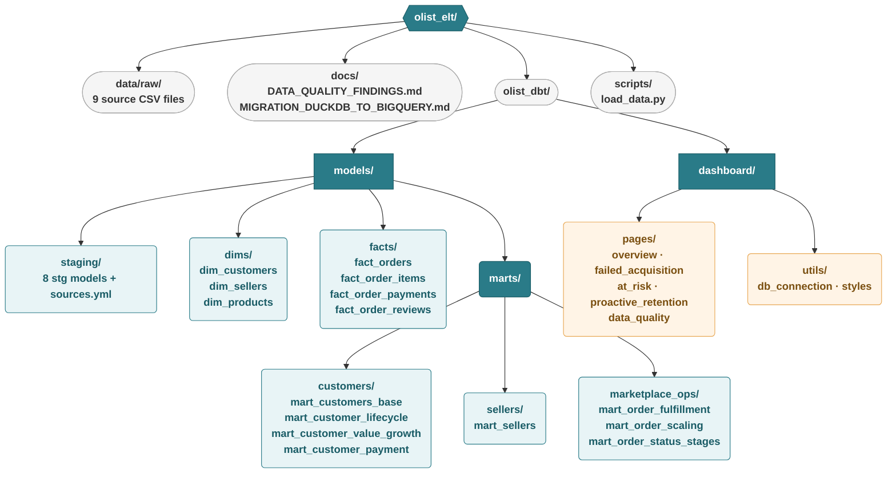

# Olist E-Commerce Data Warehouse & Customer Analytics Dashboard

An end-to-end ELT pipeline transforming Brazilian e-commerce data into a dimensional data warehouse, paired with an interactive analytics dashboard that investigates a critical business problem: **why do over 94% of customers never return after their first purchase?**

Built with **dbt + BigQuery** for data transformations and **Streamlit + Plotly** for interactive visualization.

## Technology Stack

| Component | Technology | Purpose |
|-----------|-----------|---------|
| Transformation | dbt (data build tool) | SQL-based modeling, testing, documentation |
| Database | BigQuery | Cloud analytical warehouse |
| Analytical Dashboard | Streamlit + Plotly | Interactive visualization and analysis |
| Dashboard (BI) | Looker Studio | Public-facing operational dashboard |
| Testing | dbt-utils | Advanced data quality validation (162 tests) |
| Version Control | Git / GitHub | Source control and portfolio publication |

> **Migration note:** The pipeline was originally built on DuckDB (local) 
> and migrated to BigQuery in April 2026. 
> See [`docs/MIGRATION_DUCKDB_TO_BIGQUERY.md`](docs/MIGRATION_DUCKDB_TO_BIGQUERY.md) for full details.

## Project Architecture

## Data Architecture

The pipeline follows **Kimball dimensional modeling** with four layers:

- **Staging (8 models)** - Type casting, renaming, null handling. No business logic.
- **Dimensions (3 models)** - Type 2 SCDs for customers and sellers (address history with validity periods), plus a product dimension with price metrics.
- **Facts (4 models)** - Order, item, payment, and review grains. All joined to dimensions via surrogate keys with point-in-time matching.
- **Marts (7 models)** - 30+ aggregated customer metrics feeding lifecycle classification, issue flagging, and payment segmentation.

## Dashboard

### Customer Analytics (Streamlit + Plotly)
[Five-page dashboard](https://olist-customer-analytics.streamlit.app) structured as a guided analytical narrative - see demo below.

### Marketplace Operations (Looker Studio)
[Live dashboard](https://lookerstudio.google.com/reporting/b93c68d1-45ca-4498-94df-e1941e025588) - covers order fulfillment performance, order status stages.

## Data Quality

The pipeline executes **162 dbt tests** across all layers. Seven data quality issues were investigated and documented in [`docs/DATA_QUALITY_FINDINGS.md`](docs/DATA_QUALITY_FINDINGS.md):

Each finding includes root cause analysis, business impact assessment, and recommended remediation steps.

## What I Have Learned Through The Project?

- **Kimball dimensional modelling** - four-layer architecture (staging -> demensional -> fact -> mart), understanding why each layer exists and what belongs where.
- **Type 2 Slowly Changing Dimensions with point-in-time joins** - tracking address history with validity periods, and correctly joining facts to the right dimension version using surrogate keys.
- **dbt as a transformation framework** - ref() for dependency management, schema YAML for combined documentation and testing, materialization strategies, and dbt_utils for advanced validation.
- **Strategic data quality testing** - tests with intentional severity levels and conditional WHERE clauses; investigating anomalies to root cause and documenting findings with business impact for responsible teams.
- **Designing dashboards around decisions, not descriptions** - every visualization should end with a concrete next step: which team should take action, what they look for. For example: the Failed Acquisition page doesn't just show orders got stuck, it traces each failure to the responsible team with specific investigation step.

## What Could Be Improved?
- **Geolocation + Freight Cost Analysis** - The At-Risk page already flags has_freight_burden customers, but it's just a flag without deeper investigation. The geolocation dataset would answer why freight is high (distance between seller and customer) and propose something actionable (recommend closer seller). This is the most natural extension because it fills a gap that already exists in the analysis.
- **Seller Dashboard Page** - Right now the analysis shows "seller accountability: X orders" as an aggregate number, but it cannot answer "which sellers specifically?". The built mart_sellers could trace poor customer experience, which is exactly what the Operational Failures tab hints but cannot currently deliver.

## Dataset

This project uses the [Brazilian E-Commerce Public Dataset by Olist](https://www.kaggle.com/datasets/olistbr/brazilian-ecommerce), published on Kaggle. The dataset contains approximately 100,000 orders placed between September 2016 and August 2018 on the Olist marketplace, covering order status, pricing, payment, freight performance, customer location, product attributes, and customer reviews.

## Demo
<video src="https://github.com/user-attachments/assets/771501e6-ae06-48c6-a54b-8a4046c5f6cc" controls width="100%"></video>

## License

This project is built for educational and portfolio purposes using publicly available data.